# Compiler architecture

`nexgen` turns WIT or JSON Schema input into language-specific source files.
The long-term design keeps one structural API-spec graph throughout the compiler:
`ApiSpec<F>`. A type family `F` changes the metadata attached to otherwise
equivalent services, operations, fields, and type references as passes enrich
the graph.

## Current flow

The current implementation has an explicit compiler spine. Parsing creates
authored IR; selection collapses language-specific values once; planning then
runs four named transforms over the same structural `ApiSpecTree` family.
Each pass returns a complete IR for its successor; no pass receives planner
state saved by an earlier pass.

The concrete orchestration lives in `compile_tree_to_files`: validate authored
IR, select language metadata, run the planning passes, resolve emitted names,
then generate files. The planning sequence is authored validation, language
selection, resource resolution, operation binding, operation lowering, type
planning, reachability pruning, and emitted-name resolution.

## Proposed end state

Parsing preserves author intent; target selection is the only pass that applies
language override/default precedence. Every following pass consumes selected
values and therefore cannot make a second language-selection decision.

```mermaid
flowchart LR
    input[WIT or JSON Schema input]

    subgraph frontend[Format frontend]
        witparse[Parse and resolve WIT]
        jsonparse[Parse JSON documents]
        jsonvalidate[Normalize and validate<br/>JSON Schema documents]
        buildauthored[Build authored API spec]
        jsonparse --> jsonvalidate --> buildauthored
        witparse --> buildauthored
    end

    authored[ApiSpec&lt;AuthoredNames&gt;<br/>all overrides preserved]
    validate[AuthoredValidationPass]
    select[LanguageSelectionPass]
    selected[ApiSpec&lt;SelectedNames&gt;<br/>plain selected text/import/support values]
    resources[ResourceResolutionPass]
    operation[OperationBindingPass]
    lowering[OperationLoweringPass]
    models[TypePlanningPass]
    reachability[ReachabilityPass]
    planned[ApiSpec&lt;PlannedTypeFamily&gt;]
    names[EmittedNameResolutionPass]
    generate[Language backend]
    output[Generated files]

    input --> witparse
    input --> jsonparse
    buildauthored --> authored --> validate --> select --> selected
    selected --> resources --> operation --> lowering --> models --> reachability --> planned --> names --> generate --> output
```

Passes may use descriptors and the selected target language as immutable
inputs, but they do not exchange side tables or mutable planner objects.
`ResourceResolutionPass` resolves resource-method and resource-return facts;
`OperationBindingPass` attaches those facts to the operations and resources
that own them; `OperationLoweringPass` turns wire-backed resource returns into
explicit generated result records; `TypePlanningPass` produces target-ready type metadata;
`ReachabilityPass` walks that planned graph to remove declarations outside the
generated surface; and `EmittedNameResolutionPass` fixes final JSON model
identifiers before backend dispatch.

## Invariants

- Parsers retain authored defaults and language-specific overrides; they do not
  select an output language.
- `LanguageSelectionPass` applies override precedence exactly once.
- Selected and planned IR must not carry language-indexed strings or support
  fragment maps.
- Generators consume only planned IR and render it; they do not select metadata
  or mutate planning data.
