# Compiler architecture

`nexgen` turns WIT or JSON Schema input into language-specific source files.
The long-term design keeps one structural API-spec graph throughout the compiler:
`ApiSpec<F>`. A type family `F` changes the metadata attached to otherwise
equivalent services, operations, fields, and type references as passes enrich
the graph.

## Flow

The compiler has an explicit spine. Parsing creates authored IR; selection
collapses language-specific values once; the remaining passes enrich the same
structural `ApiSpecTree` family. Each pass returns a complete IR for its
successor; no pass receives planner state saved by an earlier pass.

Each IR box in the diagram names the `TypeFamily` parameter of the
`ApiSpecTree<F>` produced at that point. A family may appear more than once
where the same tree crosses a logical phase boundary or a pass refines its
contents without changing its family.

```mermaid
flowchart LR
    subgraph parse["Input & Parsing"]
        direction TB
        input[WIT or JSON Schema input]
        authored[AuthoredFamily]

        input -->|Detect format and parse WIT| authored
        input -->|Detect format and parse JSON Schema| authored
    end

    subgraph select["Validation & Selection"]
        direction TB
        authoredForBinding[AuthoredFamily]
        validated[AuthoredFamily<br/>validated]
        selected[SelectedFamily]

        authoredForBinding -->|AuthoredValidationPass| validated
        validated -->|LanguageSelectionPass| selected
    end

    subgraph bind["Resource & Operation Binding"]
        direction TB
        selectedForBinding[SelectedFamily]
        resourceBound[ResourceBoundFamily]
        operationBound[OperationBoundFamily]

        selectedForBinding -->|ResourceResolutionPass| resourceBound
        resourceBound -->|OperationBindingPass| operationBound
    end

    subgraph plan["Lowering & Type Planning"]
        direction TB
        operationBoundForPlanning[OperationBoundFamily]
        operationLowered[OperationLoweredFamily]
        planned[PlannedFamily]
        reachable[PlannedFamily<br/>reachable]

        operationBoundForPlanning -->|OperationLoweringPass| operationLowered
        operationLowered -->|TypePlanningPass| planned
        planned -->|ReachabilityPass| reachable
    end

    subgraph emit["Emission"]
        direction TB
        reachableForEmission[PlannedFamily<br/>reachable]
        generatorReady[PlannedFamily<br/>generator-ready]
        output[Generated files]

        reachableForEmission -->|EmittedNameResolutionPass| generatorReady
        generatorReady -->|Language backend| output
    end

    authored --> authoredForBinding
    selected --> selectedForBinding
    operationBound --> operationBoundForPlanning
    reachable --> reachableForEmission
```

## Passes

- `AuthoredValidationPass` validates authored API intent and source-format
  constraints.
- `LanguageSelectionPass` selects the target-language values from authored
  language maps.
- `ResourceResolutionPass` resolves resource-method and resource-return facts
  from the API spec and descriptors.
- `OperationBindingPass` attaches resolved resource facts to their owning
  operations and resources.
- `OperationLoweringPass` turns wire-backed resource returns into explicit
  result records.
- `TypePlanningPass` materializes target-ready type metadata.
- `ReachabilityPass` removes declarations outside the generated surface.
- `EmittedNameResolutionPass` resolves final emitted JSON model identifiers.
