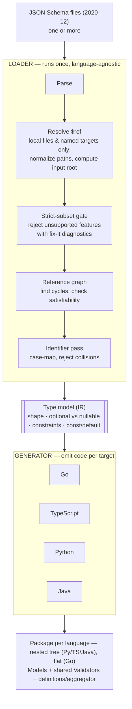
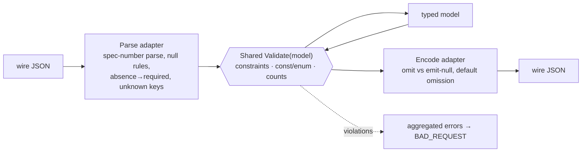

# Loader → Generator pipeline

A set of JSON Schema files becomes model code in four languages. The
loader is language-agnostic: it parses, enforces the strict subset, and
lowers everything to one shared type model. The generator emits that model
for each target. The per-file document concerns the Parse step decides
first — the two file modes and the `nexusrpc` / `$schema` root rules —
live in [[input-files]]. See [PRINCIPLES.md](PRINCIPLES.md) and
`features/<keyword>.md` for detail.

## Runtime validators

Every (de)serializer is three layers around one shared `Validate(model)`,
identical in both directions.

